# Pre Requisitos.

- [Pre Requisitos.](#pre-requisitos)
  - [1-Instalando-Virtualbox](#1-instalando-virtualbox)
  - [2-Instalando-MultiPass](#2-instalando-multipass)
  - [2-1-Configurando-MultiPass](#2-1-configurando-multipass)
  - [3-Instalando-docker-(OPCIONAL)](#3-instalando-docker-opcional)
  - [4-Usando-Docker-Compose-(OPCIONAL)](#4-usando-docker-compose-opcional)


Como tenemos una restricción por el lado de AWS, vamos a asumir que el lab se hace en tu ordenador, para ello, debemos tener Virtualbox y Multipass (aunque docker desktop podría servir inicialmente, el manejode clusters es más fácil con estos dos).


## 1-Instalando-Virtualbox

Para el hipervisor, vamos a usar Virtualbox, y como de seguro tienes un ordenador con Windows, aquí lo puedes instalar:

[Para Windows](https://download.virtualbox.org/virtualbox/7.0.14/VirtualBox-7.0.14-161095-Win.exe)

Cuando lo instale yo, me salía este error:

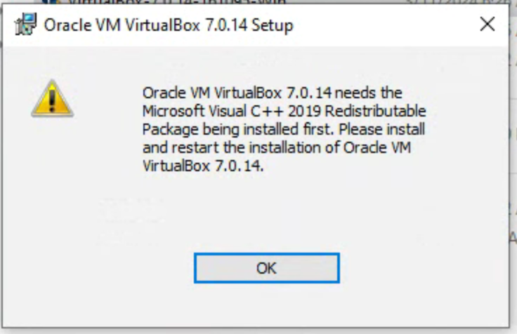
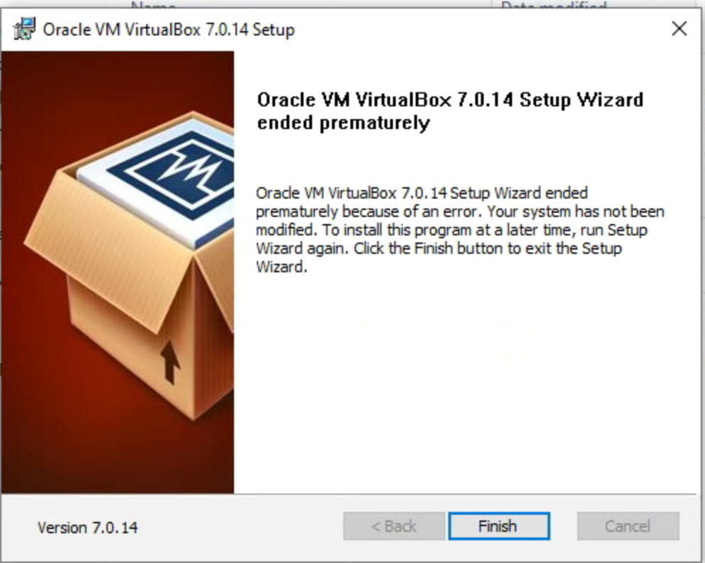

Si te sale, debes instalar este paquete de Visual Studio C++:
[Libreria Visual Studio](https://aka.ms/vs/17/release/vc_redist.x64.exe)
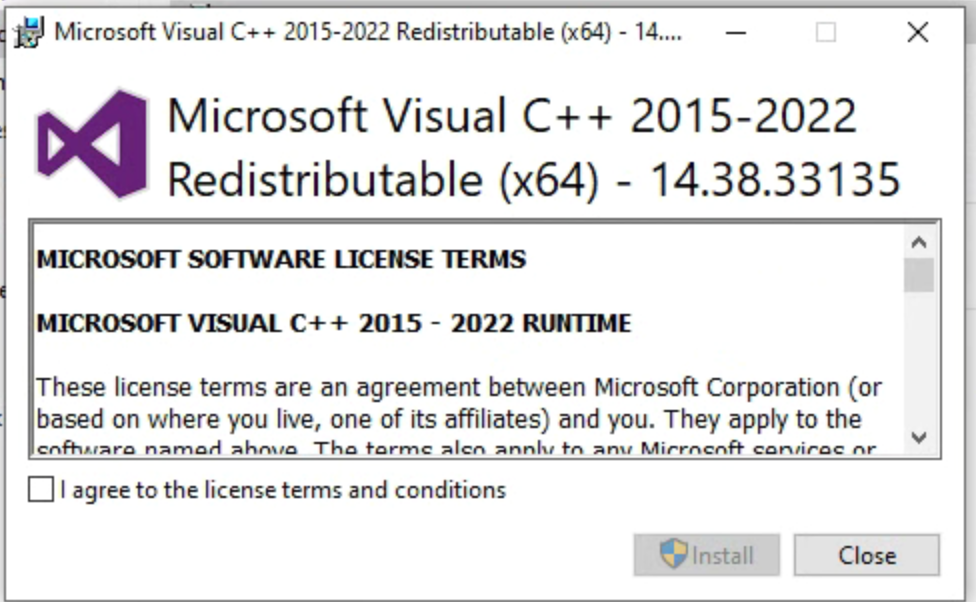

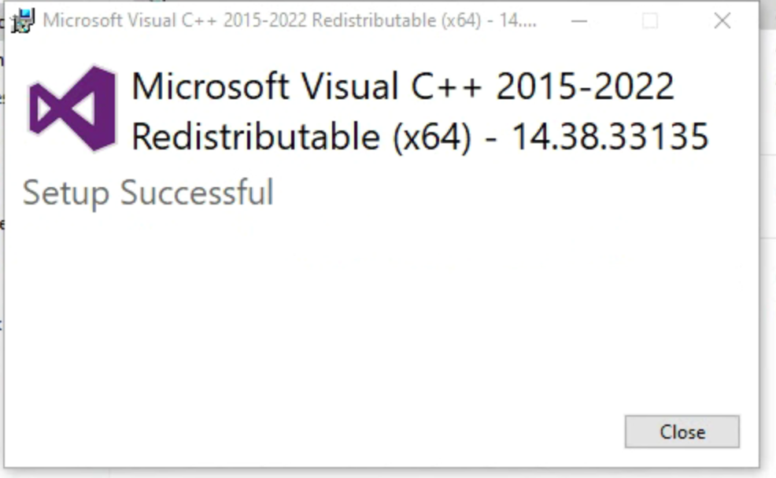

Y ahora si podemos instalar el virtualbox:


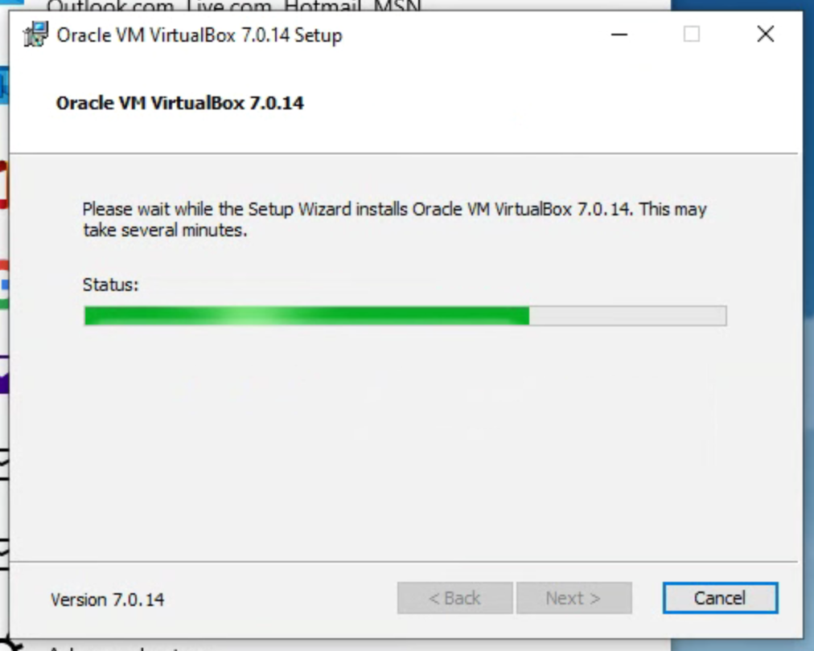
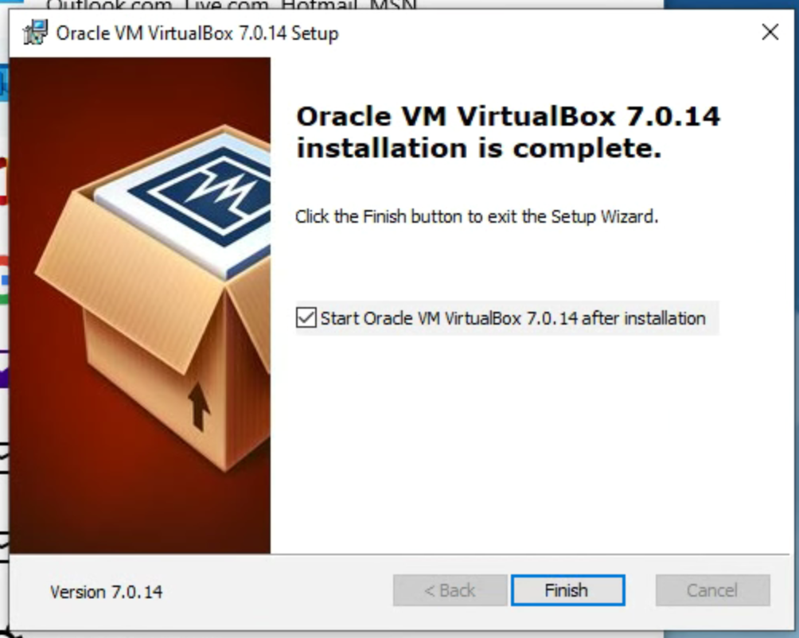

Y listo, ya tenemos instalado el virtualbox:

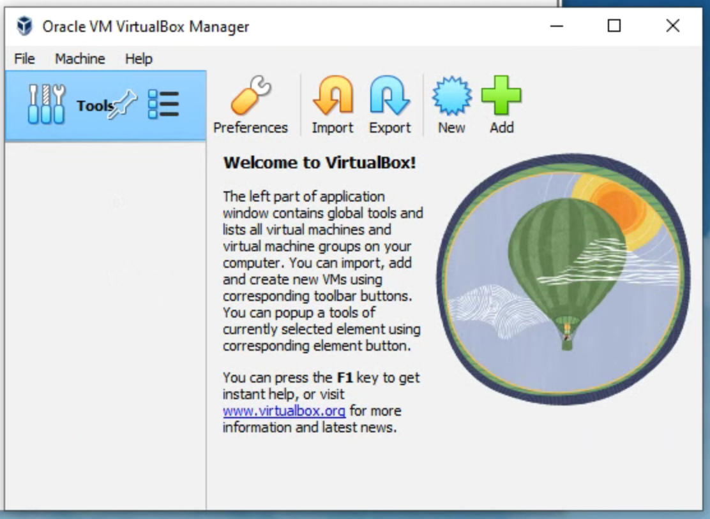

## 2-Instalando-MultiPass

Ahora vamos a descargar el multipass para windows: [Descargar aquí](https://multipass.run/download/windows)


Al momento de esta ventana, debemos seleccionar: **Oracle VM Virtualbox**:
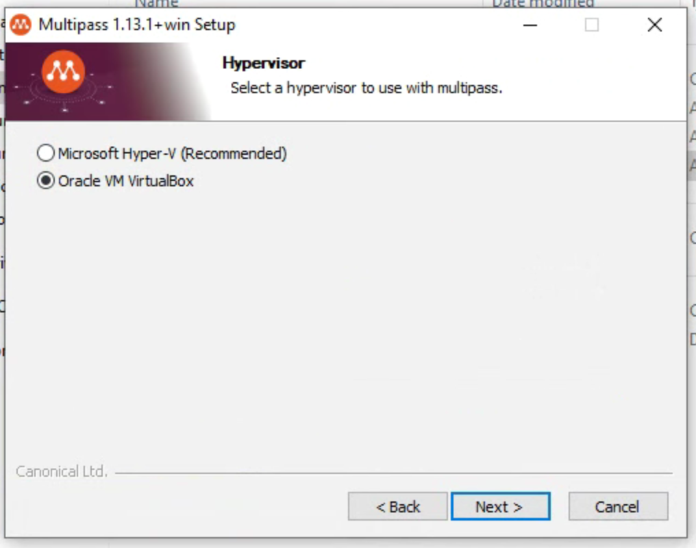


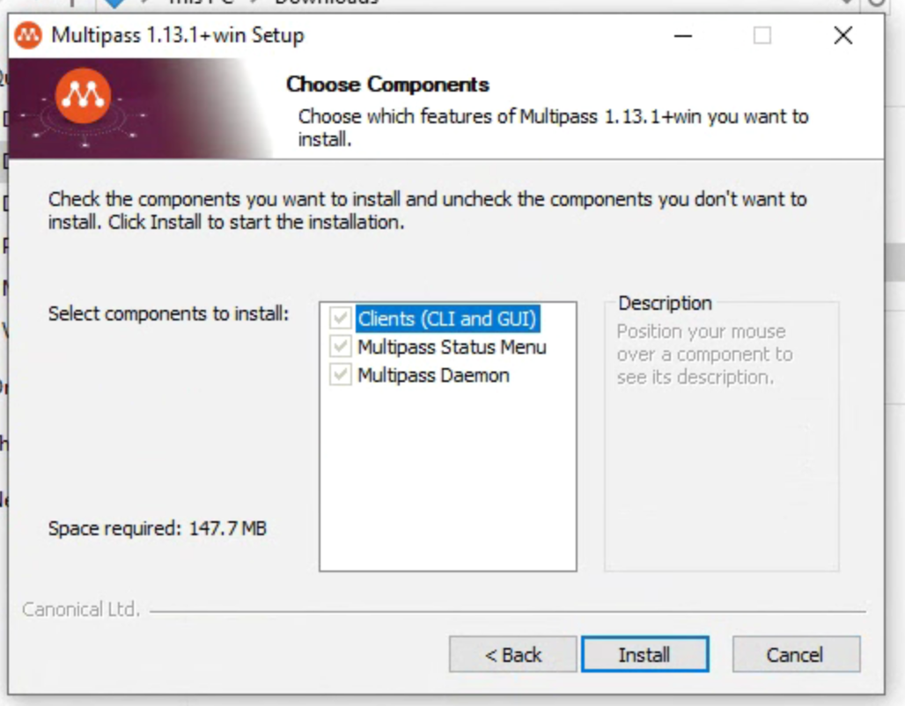

Y si abres el panel de aplicaciones instaladas en windows, veras los dos componentes ya en el sistema:


## 2-1-Configurando-MultiPass

Si ya lo tienes instalado, puedes abrir un terminal (CMD en caso de Windows), y debes ejecutar estos comandos:

`multipass launch -c 1 -m 1G -d 4G -n k3s-master 22.04`

`multipass launch -c 1 -m 1G -d 4G -n k3s-worker-1 22.04`

`multipass launch -c 1 -m 1G -d 4G -n k3s-worker-2 22.04`

Y si haces un **multipass ls**, vas a ver los nodos creados:

```
multipass ls
Name                    State             IPv4             Image
k3s-master              Running           192.168.66.2     Ubuntu 22.04 LTS
                                          10.42.0.0
                                          10.42.0.1
k3s-worker-1            Running           192.168.66.3     Ubuntu 22.04 LTS
                                          10.42.1.0
                                          10.42.1.1
k3s-worker-2            Running           192.168.66.4     Ubuntu 22.04 LTS
                                          10.42.2.0
                                          10.42.2.1
```

Ahora vamos a instalar kubernetes, usando una distribución liviana llamada [k3s](https://k3s.io/):

Corremos este comando:

 `multipass exec k3s-master -- bash -c "curl -sfL https://get.k3s.io | sh -"`

Con esto instalamos k3s en el nodo master.

Ahora exportamos estas variables de entorno para trabajar con ellas:

`TOKEN=$(multipass exec k3s-master sudo cat /var/lib/rancher/k3s/server/node-token)`

`IP=$(multipass info k3s-master | grep IPv4 | awk '{print $2}')`

Y para hacerlo recursivo corremos este for para instalar k3s en los workers usando el token anterior:

```
 for f in 1 2; do
     multipass exec k3s-worker-$f -- bash -c "curl -sfL https://get.k3s.io | K3S_URL=\"https://$IP:6443\" K3S_TOKEN=\"$TOKEN\" sh -"
 done
```

Ahora si nos logeamos en el master:

`multipass exec k3s-master -- bash`

Vamos a correar `sudo kubectl get nodes`:

```
ubuntu@k3s-master:~$ sudo kubectl get nodes
NAME           STATUS   ROLES                  AGE     VERSION
k3s-worker-1   Ready    <none>                 5h29m   v1.28.7+k3s1
k3s-worker-2   Ready    <none>                 5h29m   v1.28.7+k3s1
k3s-master     Ready    control-plane,master   5h33m   v1.28.7+k3s1
```
Y vamos a ver como ya estan los 3 nodos conectados entre si.

Si en algún momento necesitas detener los nodos, usa este comando:

`multipass stop k3s-master k3s-worker-1 k3s-worker-2`

O para borrarlas:

`multipass delete k3s-master k3s-worker-1 k3s-worker-2`

Y ahora el purge:

`multipass purge`

**NOTA:** Si quieres he dejado un script llamado: multipass.sh el cual puedes usar para crear los nodos, instalar k3s, y crear el kube/config con la IP del nodo master.

## 3-Instalando-docker-(OPCIONAL)

Para los ejercicios introductorios, vamos a ver como funcionan los contenedores, por ende se pone opcional el uso de docker desktop.

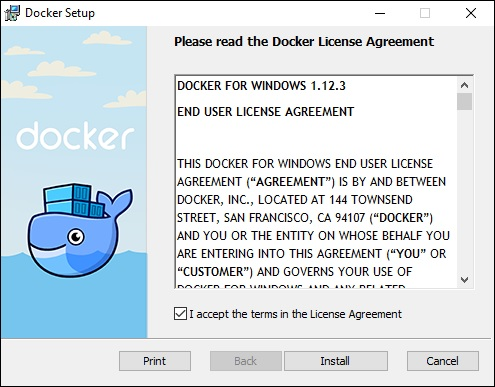

Y comprobando que funcione:

`docker run --rm alpine echo "Hola mundo"`

## 4-Usando-Docker-Compose-(OPCIONAL)

`docker-compose up -d`

<!-- ## 3. Instalando MiniKube

Primero vamos a descargar e instalar el binario según sea nuestra plataforma:[MacOS, Linux, Windows](https://minikube.sigs.k8s.io/docs/start/)

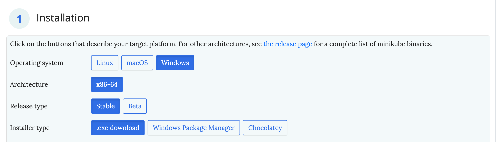

Luego de esto vamos a iniciar minikube:

`minikube start`

Y vamos a instalar kubectl: 

`minikube kubectl -- get po -A`

Si el comando anterior no funciona, debes instalarlo manualmente: 

[Click aquí](https://kubernetes.io/docs/tasks/tools/#kubectl)

Y si todo salio bien, vamos a comprobar:

```
kubectl config current-context 
minikube
```

Podemos ir a `minikube dashboard` para ver la interfaz gráfica que honestamente, nadie usa:

 -->