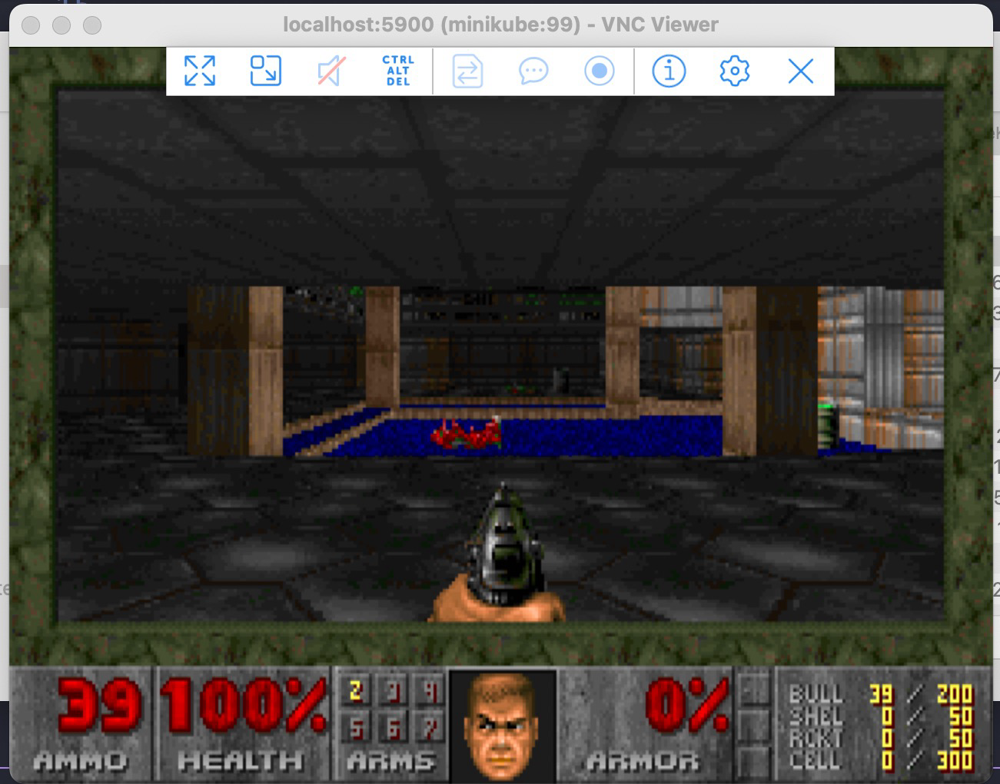

# Ejercicios Dia 03.

En este primer dia, tenemos los siguientes ejercicios:

- [Ejercicios Dia 03.](#ejercicios-dia-03)
  - [1-kubedoom](#1-kubedoom)
  - [2-replicasets](#2-replicasets)
  - [3-deployments](#3-deployments)
  - [4-arreglame](#4-arreglame)
  - [5-desplegando-apache](#5-desplegando-apache)
  - [6-daemonset](#6-daemonset)
  - [7-nodeport](#7-nodeport)
  - [8-cluster-ip](#8-cluster-ip)

## 1-kubedoom

Vamos a ver el concepto de replicas, y que mejor manera que recordar un juego clásico DOOM.

Para correrlo vamos a usar kustomization asi:

`k apply -k ./*`

Luego de esto, se debe crear un namespace llamado **kubedoom**.

Debo instalar vnc viewer para acceder al juego:

https://www.realvnc.com/en/connect/download/viewer/

Luego hago un port-forward para poder conectar al puerto del juego remotamente:

`kubectl port-forward pod/kubedoom-mi-pod -n kubedoom 5900:5900`

Abres el vncviwer, te conectas a **localhost:5901**, con la clave: **idbehold**

Y ya esta.

El truco es oprimir:
- idspispopd -> Para atravesar paredes.
- idkfa + 5 -> Para tener un arma grande.
- Con las teclas de mueves y disparas con la tecla **control**.

## 2-replicasets

Usando kustomization, aplica los manifiestos dentro de esta carpeta (App de registro de visitantes en redis), y luego usando el comando de `kubectl port-forward` mapea el puerto `8080` de tu ordenador con el `80` de la app, abre la url **localhost:8080** y confirma si los 3 pods estan funcionando.

Ahora, cambia de 3 replicas, a 5 replicas, y revisa que si se hayan creado los pods.

## 3-deployments

Esta vez, vamos a usar deployments.

Para esto, vamos a aplicar el manifiesto de esta carpeta.

Luego vamos a actualizar la imagen de nginx:1.9.1 a nginx:1.7.9

`kubectl deployment.apps/nginx-deployment set image deployment.v1.apps/nginx-deployment nginx=nginx:1.9.1`

No es la única manera, también podriamos editar el deployment directamente, aunque no se recomienda.

Ahora vamos a ver el estado del deployment:

`kubectl rollout status deployment nginx-deployment`

Y vamos a provocar un caos:

`kubectl set image deployment nginx-deployment nginx=nginx:1.9099`

Como podemos hacer un rollback de cambios a la versión que antes funcionaba?

**Truco:** La respuesta puede estar aquí https://kubernetes.io/es/docs/concepts/workloads/controllers/deployment/

## 4-arreglame

En este ejercicio hay algo mal con el deployment, revisa que es, arreglalo y despliegalo.

## 5-desplegando-apache

Crea un archivo de despliegue y debe tener:
**Nombre:** httpd-frontend
**Replicas:** 3
**Imagen:** httpd:2.4-alpine
Y todo debe correr en el namespace **ejercicio5**

**Importante**, luego de hacer el ejercicio, y comprobar que funcione, elimina todos los recursos y el namespace

**Puntos Extra**: Si usas `kustomization` para hacer el ejercicio.

## 6-daemonset

Para este ejercicio, vamos a ver como seria un archivo de daemonset, lamentablemente porque estamos usando minikube, desplegar un DS de fluentd tomaria un poco mas de trabajo extra.
Habia un addon de efk pero al parecer tiene una vulnerabilidad no parchada.

## 7-nodeport

Ejercicio para ver un servicio tipo NodePort

## 8-cluster-ip

Ejercicio para ver un servicio tipo ClusterIP