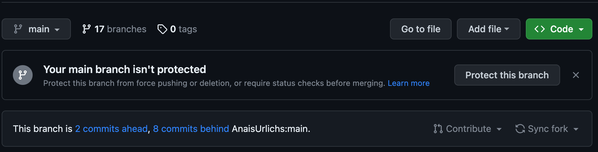
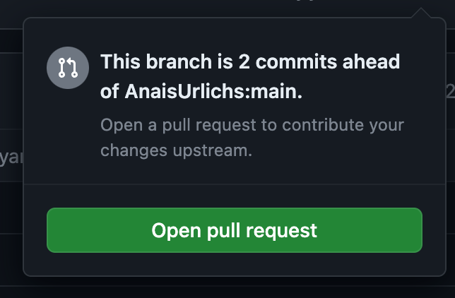
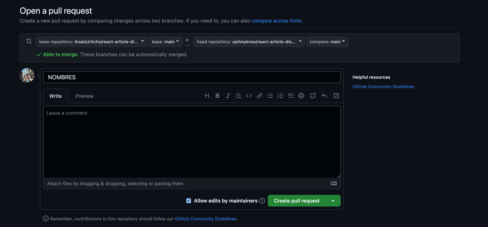

# REGLAS DE JUEGO.

## Pasos-a-seguir:

## Preparación del Entorno:

Cada estudiante deberá tener acceso a un cluster de kubernetes con 2 nodos worker y 1 master.

Hacer fork al repo.

Luego del fork si puedes clonar tu nuevo repositorio.

`git clone git@github.com:TUUSUARIO/curso-k8s-nttdata.git`

Y sobre tu repo, debes crear una carpeta con tus nombres en:

`./ejercicios/FINAL/NombreApellido`

Y allí puedes poner los manifiestos con la solución a los ejercicios planteados.

Una vez tengas todas las soluciones y te asegures que en tu cluster todo funciona bien, vas a crear un Pull Request **(PR)** sobre el repo original así:

Dar click en contribuir, y les abrira una ventana similar:

Le dan a **open pull request**, y en el título ponen su nombre y le dan a abrir pull request:

## Desarrollo de la Aplicación:

Los estudiantes deben crear los manifest necesarios para la solución. Esto incluye los archivos de Deployment, Service, ConfigMap, Secret, etc.

## Documentación:

Puntos adicionales al estudiante que proporcione una documentación apropiada y/o uso de kustomize/helm u otra herramienta.

## Creación del Pull Request (PR):

Cada estudiante debe crear un nuevo branch en el repositorio clonado con su nombre-apellido.

Realizar un commit de los archivos de configuración de la aplicación y la documentación.

Crear un PR en tu repositorio principal con tus nombres en la descripción.

## Evaluación:

Voy a revisar el PR de cada estudiante y evaluar la precisión de los archivos de configuración y la documentación proporcionada.

Agregando comentarios en el PR si es necesario, para que hagas correcciones o mejoras.

## Aprobación y Fusión:

Una vez que se este satisfecho con el trabajo de cada estudiante, aprobare y fusionare tu PR en el repositorio principal.